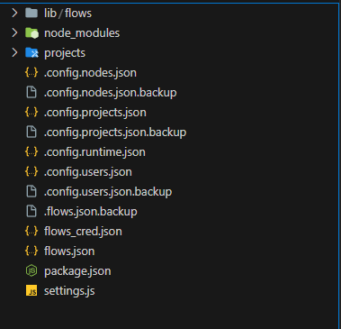
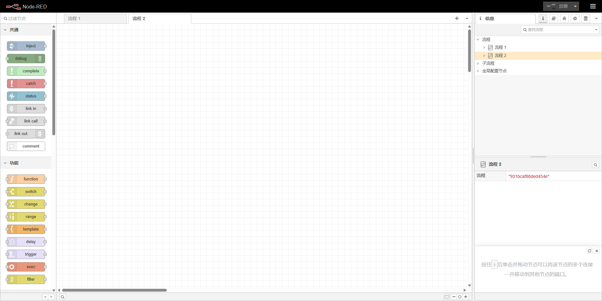
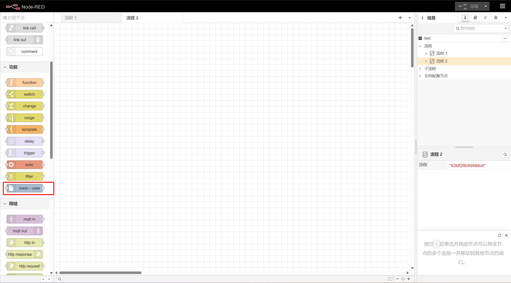

# NODE-RED 


## 简介

### 0.`Node-RED` 是什么

`Node-RED`最初是IBM在2013年末开发的一个开源项目，用于将硬件设备，API和在线服务作为物联网的一部分连接在一起。它是由IBM技术团队发起的，基于数据流（`dataflow`）的可视化编程工具。它现在由Node-RED项目团队维护，该团队由IBM和其他贡献者组成

`Node-RED`是一种编程工具，用于以新颖有趣的方式将硬件设备、API和在线服务连接在一起。它是构建物联网(IOT，Internet of Things)应用程序的一个强大工具，其重点是简化代码块的“连接”以执行任务。它提供了一个基于浏览器的**流编辑器**，可以方便地使用调色板中的各种节点来连接流，并可以一键部署到运行时。Node-RED基于Node.js构建，可以运行在各种平台上，如本地计算机、树莓派、**Docker**或云服务。

### 1.Node-RED可以做什么

Node-RED可以做很多有趣和有用的事情，例如：连接硬件设备、API和在线服务，构建物联网应用程序，创建Web服务和图形用户界面，实现家庭自动化，发送和接收MQTT消息等。Node-RED使用可视化编程方法，允许开发人员将预定义的代码块（称为“**节点**”，Node）连接起来执行任务。连接的节点，通常是输入节点、处理节点和输出节点的组合，当它们连接在一起时，构成一个“**流**” (Flows)。

## 如何启动
### 0.通过开源项目启动
首先在本地需要有`nodejs`的执行环境, `LTS`版本的`nodejs`即可.

- Clone项目到本地
```shell
git clone https://github.com/node-red/node-red.git # Clone
```
- 在项目根目录中执行
```shell
npm install  # 安装项目依赖
```
- 编译代码
```shell
npm run build
```
- 运行
```shell
npm start
```
- 打开浏览器访问
```
http://localhost:1880
```

需要注意的是, 项目启动后, 针对流程编辑后的数据都保存在本地目录, 存储的位置取决于启动应用的用户.
```shell
# 例如 /home/cyuser/.node-red,  cyuser就是启用应用的用户
/home/[用户名]/.node-red
```
### 1.通过Docker镜像启动
- 获取镜像
```shell
docker pull nodered/node-red
```

- 启动

指定存储映射目录
```shell
docker run -itd -p 1880:1880 -v [本地存储目录]:/data --name mynodered nodered/node-red
```

详细的说明[参见文档](https://nodered.org/docs/getting-started/docker)

### 2.存储目录
默认情况下, 不管是通过源代码启动还是通过`Docker`启动, `Node-RED`都会把流程中的配置以`JSON`的形式存储在本地目录.

以下是存储目录中的文件结构



下面是一些主要的文件

- **node_modules**
自定义的节点代码会放在此处.
- **projects**
如果启用了项目管理, 在所有的项目会以文件夹的形式区分存储在该目录下.
- **settings.js**
整个Node-RED应用的配置文件, 可以配置例如项目管理, 用户登录, 权限等功能, 详细可以参考
- **package.json**
自定义节点的引导配置, `node-red` 通过这里知道有那些自定义的节点.
- **flows.json**
在不开启项目管理的情况下, 这个文件里面保存了所有的流程, 节点的配置信息, .

### 3.自定义存储
前面提到在默认情况下, `node-red`会将数据存储在本地文件目录中, 实际上也可以令其存储在其他的位置, 具体要存储在哪里, 按照node-red的规范实现一套接口就可以了.

具体实现方式可[参见文档](https://nodered.org/docs/api/storage/)

## 布局介绍
打开浏览器之后访问`node-red`的主页面是这样的


### 节点
左侧 区域 就是所有可以拖动到中间区域的节点

### 流程
顶部的`tabs`选项卡区域中, 每一个`tab`代表着一个流程

### 调试窗口
右侧区域顶部的选项卡中有一个像`虫子`图标的选项卡就是调试窗口, 当流程在运行的过程中, 可以配合`debug`节点打印出`变量`或者`节点输出的数据`

### 上下文数据
右侧区域顶部的选项卡中有一个像`数据库`图标的选项卡就是上下文数据, 当流程在运行的过程中, 可以点击刷新按钮查看上下文中的数据.

#### 节点上下文

作用域为节点内部，当流程被重启（重新部署后），值被重置或者消失。

```javascript
// 设置值
context.set('KEY', value)

// 获取值
context.get('KEY')
```
#### 流程上下文
作用域为某一流程内。

```javascript
// 设置值
flow.set('KEY', value)

// 获取值
flow.get('KEY')
```
#### 全局上下文

作用域为整个应用程序内，`node-RED`被重启后，值消失。

```javascript
// 设置值
global.set('KEY', value)

// 获取值
global.get('KEY')
```
## 节点演示与介绍

## 管理员API
[参见文档](https://nodered.org/docs/api/admin/)

## 使用案例介绍

### 某论坛定期签到灌水

请求接口

```txt
POST
http://10.6.3.15:1880/flow
```

body
```json
{
	"type": "tab",
	"label": "灌水与签到",
	"nodes": [
		{
			"id": "16dd072da354a51a",
			"type": "inject",
			"name": "每2小时",
			"props": [
				{
					"p": "payload"
				},
				{
					"p": "topic",
					"vt": "str"
				}
			],
			"repeat": "7200",
			"crontab": "",
			"once": false,
			"onceDelay": 0.1,
			"topic": "",
			"payload": "",
			"payloadType": "date",
			"x": 140,
			"y": 160,
			"wires": [
				[
					"78fe082ba50204e0"
				]
			]
		},
		{
			"id": "519ab0037656f9ca",
			"type": "http request",
			"name": "灌水",
			"method": "POST",
			"ret": "obj",
			"paytoqs": "ignore",
			"url": "https://www.hdsay.net/api/services/app/ForumSiteArticleReply/SaveSiteArticleReply",
			"tls": "",
			"persist": false,
			"proxy": "",
			"insecureHTTPParser": false,
			"authType": "",
			"senderr": false,
			"headers": [
				{
					"keyType": "other",
					"keyValue": "Cookie",
					"valueType": "msg",
					"valueValue": "cookie"
				},
				{
					"keyType": "other",
					"keyValue": "x-xsrf-token",
					"valueType": "msg",
					"valueValue": "token"
				},
				{
					"keyType": "other",
					"keyValue": "x-requested-with",
					"valueType": "other",
					"valueValue": "XMLHttpRequest"
				},
				{
					"keyType": "Content-Type",
					"keyValue": "",
					"valueType": "other",
					"valueValue": "application/json"
				}
			],
			"x": 690,
			"y": 240,
			"wires": [
				[
					"6195519063681c87",
					"123e3ad7b73ad143"
				]
			]
		},
		{
			"id": "78fe082ba50204e0",
			"type": "function",
			"name": "参数",
			"func": "const ids = [\n    \"30\", // 复仇者联盟4：终局之战 / AVG4 / Avengers: Infinity War - Part II / The Avengers 3: Part 2 / The Avengers 4: Endgame / 复仇者联盟3：无尽之战(下) / 复联4\n    \"2051\", // 九品芝麻官之白面包青天 / Hail the Judge\n    \"5029\", // 闪灵\n    \"44929\", // 我不是药神\n    \"23115\", // 水之道\n    \"83604\", // 脐带\n];\n\nconst idIndex = Math.ceil(Math.random() * ids.length)\n\nconst replayMsg = [\n    '这个简直就是神迹的存在',\n    '谢谢好资源分享',\n    '感谢楼主分享，发贴辛苦。。',\n    '好东东，我喜欢。',\n    '当爱由彼此羁绊化为理解和自由， 母亲终于回到心中的故乡',\n    '很好的影片，感谢分享',\n    '感谢楼主分享！！！！！！',\n    '谢谢楼主大力共享。',\n    '看看什么样的',\n    '感谢楼主分享~~~~',\n    '日出而作兮日入归，如彼草木兮雨露肥。',\n    '赚金币 看超清',\n    '感谢楼主分享，下载收藏！！！',\n    '感谢分享 真的吗？',\n    '多谢楼主分享。收藏中。'\n]\nconst msgIndex = Math.ceil(Math.random() * ids.length)\n\nreturn {\n    payload: {\n        \"target\": \"1\",\n        \"source\": null,\n        \"articleId\": ids[idIndex],\n        \"columnId\": \"23\",\n        \"replyId\": null,\n        \"bodyText\": replayMsg[msgIndex],\n        \"body\": replayMsg[msgIndex]\n    },\n    rejectUnauthorized: false,\n    cookie: flow.get('cookie'),\n    token: flow.get('token')\n};",
			"outputs": 1,
			"noerr": 0,
			"initialize": "// 部署节点后，此处添加的代码将运行一次。 \nflow.set('cookie', '__jsluid_s=30c52ecf6fcdda36986bd6c9d4e491a2; .AspNetCore.Antiforgery.a7NRbebF8Bg=CfDJ8LlayCIgwUpItqRMcYDbciFpDqh3B3yTI4aYDIBHAxTd2Sp4wWQCLo4k453hujAafQ8Ils09Ycq_L9DMjGTlDSgSj2NELQ83xLCbZBENe-KOek9B__zo68EaMNx-ouvuzoT2KzifFP6Xi_-dDu-c1Yc; .AspNetCore.Identity.Application=CfDJ8LlayCIgwUpItqRMcYDbciGeKQTZr2TvY4WyUJZTj7b6PYeUb9SswUTEwvUwNiYBM6ZhwBjRB7wsHDJYPi6ELLvf51946HWkzxegjZKzOaXnqPJQlMeSYcOpLNC2mZn08Ys6BU1SL0FsQm2v6UutH1rzwLvf0CvNXXSqQXpwIQGSW0HlLeWZgEdjubIlNhJBlw9I-38P_W7fG87ojyNASXnb3CpW2_SPeqo4pKGI0euxlCxrlPycs4DHR4k-KY0fh5avJMQvgGVdBAXvznQsEOeN-kq6xSRfb6TswNj3d-xkhjgFJFzQh6Ogo_WmjSAzxXeT-rght9tyLaHwz15tTQb5EoxyidxW3a_yuNWO9ktb_LIFF7GZKDglmL7Yi2wtZ_1eKbrcalGLkUm9lrQJ6QpqEvFVDjYgIQoKB3v6DTvtDlGhl42lGRvwhUaukOES2xNHTu46oiK1dYqdP_eII1usiiIGNnO8Ayrn2YCgYIOsypDTbllPvpcE2ffPebcchJzk-PO7hhQA6j1QrYMksxY7dQyfQjqc-Fie_oLdnZb__b4SMZkEN-d1uPZl-eqoMotgkUZehdo02vSkzXPBQSOgLsNcyQfRB16SeezJ0TRTWIJppPoyHXopsUg2zn-ka1QuvOdxSxndipX6-eq14tM; XSRF-TOKEN=CfDJ8LlayCIgwUpItqRMcYDbciEoLN5JhH53VEI5DttdiHlkPGtqf5IJpMRIimg_X_PulzdkeYwAM4DXreLzQvfC1iTFKSEVm_E-1GKGRRBl4DXMhRIKPSsh8qDg92zIeJrXzONCnXlFVRs47ZoaY-XLAwy9qq4stcgpH0PrQL4LUcg5wMAv2WH-bYVtzqsBtS3A5A')\nflow.set('token', 'CfDJ8LlayCIgwUpItqRMcYDbciEoLN5JhH53VEI5DttdiHlkPGtqf5IJpMRIimg_X_PulzdkeYwAM4DXreLzQvfC1iTFKSEVm_E-1GKGRRBl4DXMhRIKPSsh8qDg92zIeJrXzONCnXlFVRs47ZoaY-XLAwy9qq4stcgpH0PrQL4LUcg5wMAv2WH-bYVtzqsBtS3A5A')",
			"finalize": "",
			"libs": [],
			"x": 330,
			"y": 260,
			"wires": [
				[
					"e6eda13f91e2d710",
					"3483c617cfeae853"
				]
			]
		},
		{
			"id": "6195519063681c87",
			"type": "debug",
			"name": "结果",
			"active": true,
			"tosidebar": true,
			"console": false,
			"tostatus": false,
			"complete": "true",
			"targetType": "full",
			"statusVal": "",
			"statusType": "auto",
			"x": 810,
			"y": 120,
			"wires": []
		},
		{
			"id": "e6eda13f91e2d710",
			"type": "debug",
			"name": "参数",
			"active": false,
			"tosidebar": true,
			"console": false,
			"tostatus": false,
			"complete": "payload",
			"targetType": "msg",
			"statusVal": "",
			"statusType": "auto",
			"x": 510,
			"y": 120,
			"wires": []
		},
		{
			"id": "2c93fdede4dca273",
			"type": "catch",
			"name": "",
			"scope": [
				"519ab0037656f9ca"
			],
			"uncaught": false,
			"x": 120,
			"y": 380,
			"wires": [
				[
					"78fe082ba50204e0"
				]
			]
		},
		{
			"id": "123e3ad7b73ad143",
			"type": "function",
			"name": "保存cookie和token",
			"func": "const { cookie, token } = msg\nflow.set('cookie', cookie)\nflow.set('token', token)\n\nreturn msg;",
			"outputs": 1,
			"noerr": 0,
			"initialize": "",
			"finalize": "",
			"libs": [],
			"x": 850,
			"y": 300,
			"wires": [
				[]
			]
		},
		{
			"id": "f9a7a55ef4f59428",
			"type": "inject",
			"name": "每天执行一次",
			"props": [
				{
					"p": "payload"
				}
			],
			"repeat": "86400",
			"crontab": "",
			"once": false,
			"onceDelay": "1",
			"topic": "",
			"payload": "",
			"payloadType": "date",
			"x": 100,
			"y": 600,
			"wires": [
				[
					"5225f5a987da0bcd"
				]
			]
		},
		{
			"id": "91e4f1bd183eba54",
			"type": "http request",
			"name": "签到之前的请求",
			"method": "GET",
			"ret": "obj",
			"paytoqs": "ignore",
			"url": "https://www.hdsay.net/api/services/app/ForumMemberSign/GetNewWithUserId?userId=372866",
			"tls": "",
			"persist": false,
			"proxy": "",
			"insecureHTTPParser": false,
			"authType": "",
			"senderr": false,
			"headers": [
				{
					"keyType": "other",
					"keyValue": "Cookie",
					"valueType": "msg",
					"valueValue": "cookie"
				},
				{
					"keyType": "other",
					"keyValue": "x-xsrf-token",
					"valueType": "msg",
					"valueValue": "token"
				},
				{
					"keyType": "other",
					"keyValue": "x-requested-with",
					"valueType": "other",
					"valueValue": "XMLHttpRequest"
				},
				{
					"keyType": "other",
					"keyValue": "",
					"valueType": "other",
					"valueValue": ""
				}
			],
			"x": 640,
			"y": 620,
			"wires": [
				[
					"dc8aafc3b823bec0",
					"3abe5ba814c7f7ed"
				]
			]
		},
		{
			"id": "dc8aafc3b823bec0",
			"type": "function",
			"name": "构建签到数据",
			"func": "const { payload } = msg\n\nconst data = {\n    \"isActive\": true,\n    \"creatorUserName\": null,\n    \"lastModifierUserName\": null,\n    \"lastModificationTime\": null,\n    \"moodName\": \"开心\",\n    \"inputModeName\": \"自己填写\",\n    \"userId\": 372866,\n    \"mood\": \"1\",\n    \"moodWords\": \"日出而作兮日入归，如彼草木兮雨露肥。\",\n    \"inputMode\": \"1\",\n    \"description\": null,\n    \"version\": 0,\n    \"id\": \"00000000-0000-0000-0000-000000000000\",\n    \"__RequestVerificationToken\": flow.get('token')\n}\n\n\nreturn {\n    payload: {\n        ...payload,\n        ...data\n    },\n    rejectUnauthorized: false,\n    cookie: flow.get('cookie'),\n    token: flow.get('token')\n};",
			"outputs": 1,
			"noerr": 0,
			"initialize": "",
			"finalize": "",
			"libs": [],
			"x": 860,
			"y": 720,
			"wires": [
				[
					"58a4cc52786ec2f5"
				]
			]
		},
		{
			"id": "3abe5ba814c7f7ed",
			"type": "debug",
			"name": "debug 2",
			"active": true,
			"tosidebar": true,
			"console": false,
			"tostatus": false,
			"complete": "false",
			"statusVal": "",
			"statusType": "auto",
			"x": 840,
			"y": 480,
			"wires": []
		},
		{
			"id": "58a4cc52786ec2f5",
			"type": "http request",
			"name": "发送签到请求",
			"method": "POST",
			"ret": "obj",
			"paytoqs": "ignore",
			"url": "https://www.hdsay.net/api/services/app/ForumMemberSign/Create",
			"tls": "",
			"persist": false,
			"proxy": "",
			"insecureHTTPParser": false,
			"authType": "",
			"senderr": false,
			"headers": [
				{
					"keyType": "other",
					"keyValue": "x-xsrf-token",
					"valueType": "msg",
					"valueValue": "token"
				},
				{
					"keyType": "other",
					"keyValue": "Cookie",
					"valueType": "msg",
					"valueValue": "cookie"
				},
				{
					"keyType": "other",
					"keyValue": "x-requested-with",
					"valueType": "other",
					"valueValue": "XMLHttpRequest"
				},
				{
					"keyType": "Content-Type",
					"keyValue": "",
					"valueType": "other",
					"valueValue": "application/json"
				}
			],
			"x": 1060,
			"y": 560,
			"wires": [
				[
					"c436f02ba6ca0e7f"
				]
			]
		},
		{
			"id": "c436f02ba6ca0e7f",
			"type": "debug",
			"name": "debug 3",
			"active": true,
			"tosidebar": true,
			"console": false,
			"tostatus": false,
			"complete": "payload",
			"targetType": "jsonata",
			"statusVal": "",
			"statusType": "auto",
			"x": 1240,
			"y": 680,
			"wires": []
		},
		{
			"id": "dc1723e9ea7658aa",
			"type": "function",
			"name": "构建验证数据",
			"func": "\nreturn {\n    rejectUnauthorized: false,\n    cookie: flow.get('cookie'),\n    token: flow.get('token')\n};",
			"outputs": 1,
			"noerr": 0,
			"initialize": "",
			"finalize": "",
			"libs": [],
			"x": 500,
			"y": 460,
			"wires": [
				[
					"91e4f1bd183eba54"
				]
			]
		},
		{
			"id": "3483c617cfeae853",
			"type": "delay",
			"name": "随机延迟",
			"pauseType": "random",
			"timeout": "5",
			"timeoutUnits": "seconds",
			"rate": "1",
			"nbRateUnits": "1",
			"rateUnits": "second",
			"randomFirst": "1",
			"randomLast": "5",
			"randomUnits": "minutes",
			"drop": false,
			"allowrate": false,
			"outputs": 1,
			"x": 520,
			"y": 340,
			"wires": [
				[
					"519ab0037656f9ca"
				]
			]
		},
		{
			"id": "5225f5a987da0bcd",
			"type": "delay",
			"name": "",
			"pauseType": "random",
			"timeout": "5",
			"timeoutUnits": "seconds",
			"rate": "1",
			"nbRateUnits": "1",
			"rateUnits": "second",
			"randomFirst": "1",
			"randomLast": "5",
			"randomUnits": "minutes",
			"drop": false,
			"allowrate": false,
			"outputs": 1,
			"x": 250,
			"y": 460,
			"wires": [
				[
					"dc1723e9ea7658aa"
				]
			]
		}
	],
    "configs": []
}

```

流程配置说明

- 登录某论坛
- 获取签到API URL、headers中的参数，例如Cookies
- 拖入inject设置执行周期
- 拖入http request ， 设置签到API URL，请求参数、headers
- 连接节点


访问网站

```txt
https://www.hdsay.net
```

### 格物报警规则应用

流程介绍

## 自定义节点


### 初始化一个nodejs工程

- 在本地路径中初始化例如
```txt
/home/cyuser/node-red-custom-node
```

执行
```shell
npm init
```

项目名称, 然后一路回车即可
```txt
node-red-contrib-example-lower-case
```

- 更新 `package.json`

```json
{
    "name" : "node-red-contrib-example-lower-case",
    "node-red" : {
        "nodes": {
            "lower-case": "lower-case.js"
        }
    }
}
```

- 创建 `lower-case.js`
```js
module.exports = function(RED) {
    function LowerCaseNode(config) {
        RED.nodes.createNode(this,config);
        var node = this;
        node.on('input', function(msg) {
            msg.payload = msg.payload.toLowerCase();
            node.send(msg);
        });
    }
    RED.nodes.registerType("lower-case",LowerCaseNode);
}
```

- 创建 `lower-case.html`
```html
<script type="text/javascript">
    RED.nodes.registerType('lower-case',{
        category: 'function',
        color: '#a6bbcf',
        defaults: {
            name: {value:""}
        },
        inputs:1,
        outputs:1,
        icon: "file.png",
        label: function() {
            return this.name||"lower-case";
        }
    });
</script>

<script type="text/html" data-template-name="lower-case">
    <div class="form-row">
        <label for="node-input-name"><i class="fa fa-tag"></i> Name</label>
        <input type="text" id="node-input-name" placeholder="Name">
    </div>
</script>

<script type="text/html" data-help-name="lower-case">
    <p>A simple node that converts the message payloads into all lower-case characters</p>
</script>
```

- 在`node-red`存储目录中执行
```shell
npm install ~/node-red-custom-node
```

此时`package.json`中的内容如下:
```json
{
    "name": "node-red-project",
    "description": "A Node-RED Project",
    "version": "0.0.1",
    "private": true,
    "dependencies": {
        "node-red-contrib-example-lower-case": "file:../node-red-custom-node"
    }
}
```

刷新页面后



## 节点商店

### 读写数据库 mysql

### 企业微信机器人

## 总结


